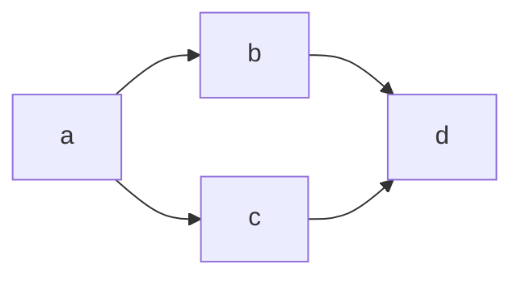

## 二级标题
### 三级标题

这是**粗体**，这是 _斜体_。 然后这是个 `标签`

> 这是一条引用

这是一条链接: https://github.com/mivinci

~~呀！打错了~~ 重新打过，输入一个列表

- 第一项
- 第二项

再画一个中间对齐的表格

|功能|工具|
|:-:|:---:|
|公式|KaTeX|
|图|Mermaid|

行内公式: $\int_{a}^{b}{f(x)dx}$

块级公式：

$$
\displaystyle \left( \sum_{k=1}^n a_k b_k \right)^2 \leq \left( \sum_{k=1}^n a_k^2 \right) \left( \sum_{k=1}^n b_k^2 \right)
$$

还可以画图，我厉害吧。

